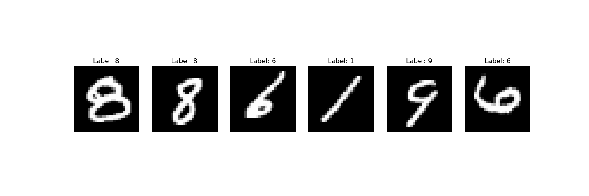
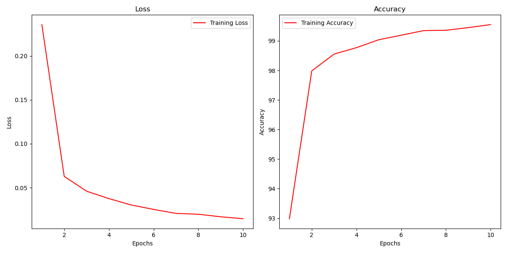
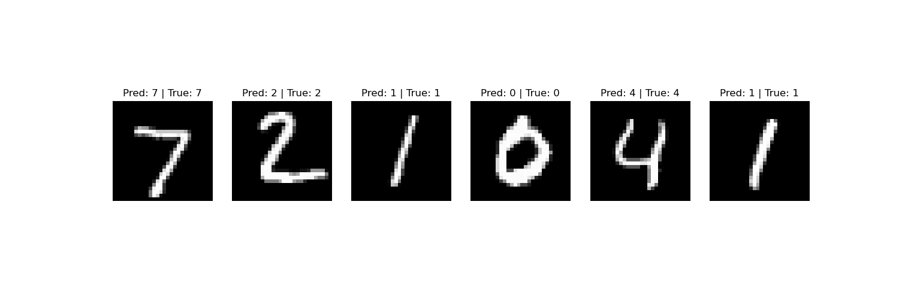
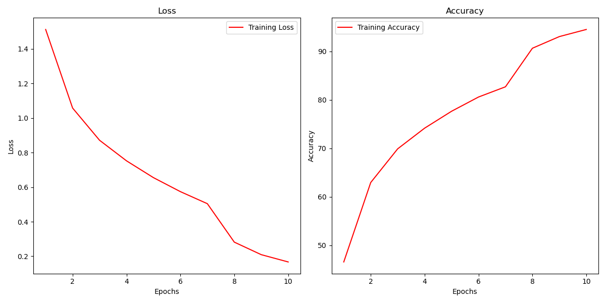
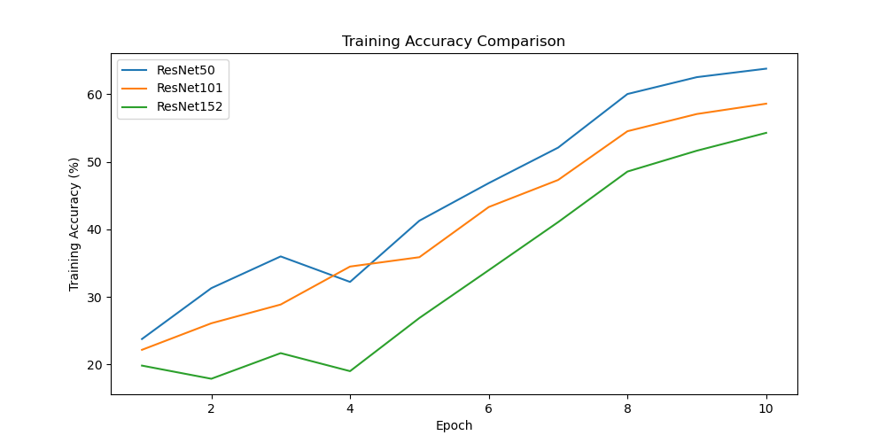
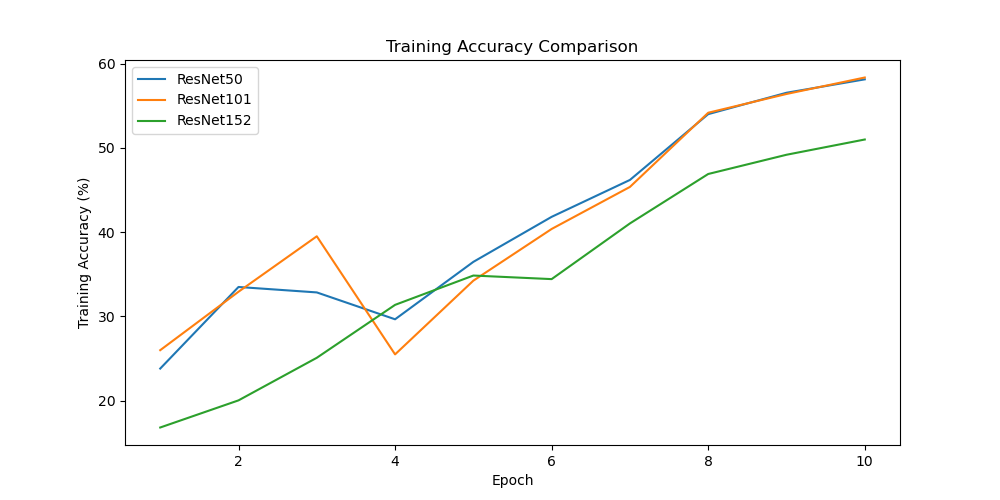
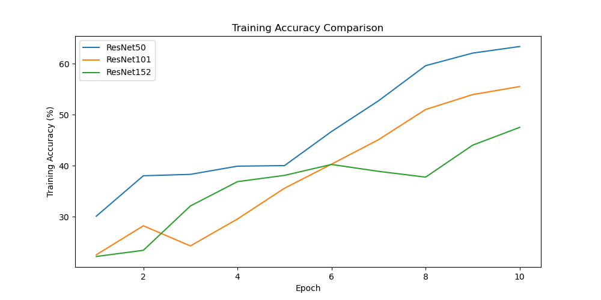
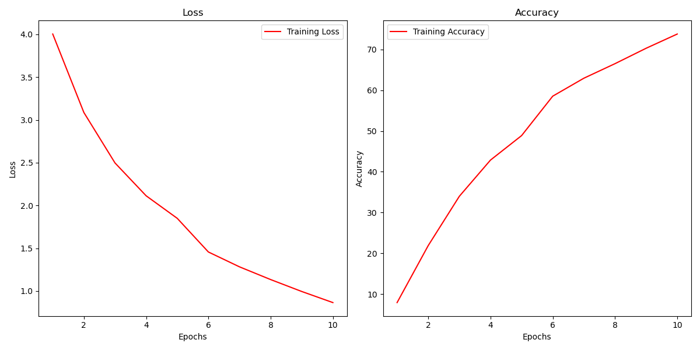
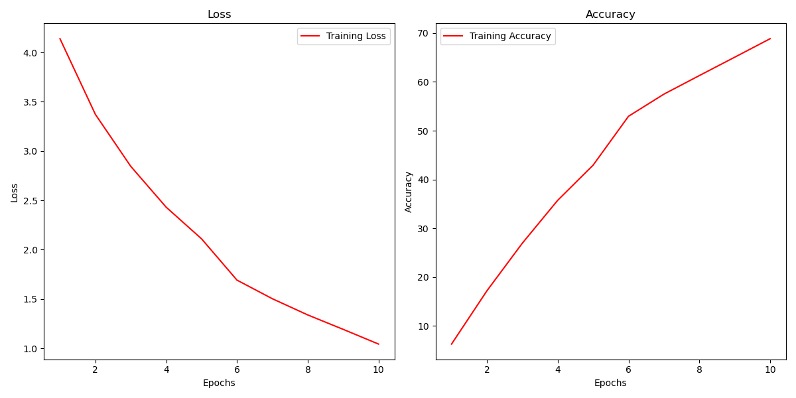
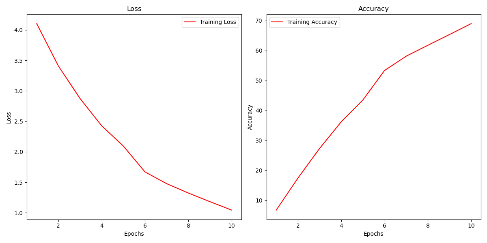

# Playing with CNN Architectures

This repository is dedicated to experimenting with and implementing different Convolutional Neural Network (CNN) architectures. I created this repo as part of my learning process. If you're still learning like me, hope this repo helps~

The repository will include the following CNN architectures:

- **LeNet** ✅ (Completed)
- **VGG (VGG11, VGG13, VGG16, VGG19)** ✅ (Completed)
- **GoogLeNet/InceptionNet** ✅ (Completed)
- **ResNet** ✅ (Completed)
- **EfficientNet** ✅ (Completed)


## Installation

Clone this repository to your local machine:
```bash
git clone https://github.com/cxycode32/Playing-With-CNN-Architectures.git
cd Playing-With-CNN-Architectures
```

Install the required dependencies:
```bash
pip install -r requirements.txt
```

### File Structure
```
├── lenet.py               # LeNet implementation and training script
├── vgg.py                 # VGG implementation and training script
├── inceptionnet.py        # GoogLeNet/InceptionNet implementation and training script
├── resnet.py              # ResNet implementation and training script
├── efficientnet.py        # EfficientNet implementation and training script
├── utils.py               # Utility functions
└── requirements.txt       # Project dependencies
```


## LeNet Implementation

LeNet is a CNN architecture developed by Yann LeCun for handwritten digit recognition. It consists of alternating convolutional and pooling layers, followed by fully connected layers, making it efficient for image classification tasks.

### Features:

- Training pipeline for MNIST digit classification.
- Data visualization.
- Feature maps visualiation.
- Training metrics visualization.
- Prediction visualization.

### How to Run?
```
python lenet.py
```

### Visualization:

#### Data (Images and Labels) Visualization
Helper function to visualize a batch of images and labels from the DataLoader.
```
# utils.py
def visualize_data(loader):
```


#### Training Loss and Accuracy
Helper function to visualize training and validation loss and accuracy.
```
# utils.py
def plot_training_metrics(train_loss, train_acc, val_loss=None, val_acc=None):
```


#### Predictions Visualization
Helper function to visualize predictions on test data.
```
# utils.py
def visualize_pred(model, loader):
```



## VGG Implementation

VGG is a deep convolutional neural network (CNN) architecture developed by the Visual Geometry Group at Oxford. It features a uniform design with 3×3 convolutional layers stacked deep, followed by fully connected layers. VGG is known for its simplicity, depth, and strong performance in image classification tasks, making it a benchmark in computer vision research.

### Features:

- Multiple VGG architectures for you to play with.
- Basic visualizations add on feature maps and embeddings visualizations.

### How to Run?
```
python vgg.py
```

### Training Different VGG Architectures

When training the model, you may realize some take longer to train, this is caused by:
- **Number of Parameters:** More parameters mean more computations for both forward and backward passes.
- **Network Depth:** Deeper networks equal more layers to propagate the data through and more gradients to compute.
- **Size of Input Data:** Larger inputs require more processing time.
- **Batch Size:** Larger batch sizes can lead to faster training per epoch but also require more memory, which may slow down the training process if the hardware is not sufficient.
- **Optimization Algorithm:** Your hyperparameters can impact training speed.
Of course there are many other factors that affect the model training time, you can do some research on your own if you're interested.

#### Sample Metrics Training VGG11
```
Epoch [1/10], Loss: 2.2400, Accuracy: 21.09%, 
Epoch [2/10], Loss: 1.7921, Accuracy: 30.28%, 
Epoch [3/10], Loss: 1.4089, Accuracy: 48.53%, 
Epoch [4/10], Loss: 1.1012, Accuracy: 61.25%, 
Epoch [5/10], Loss: 0.9006, Accuracy: 68.64%, 
Epoch [6/10], Loss: 0.7754, Accuracy: 73.21%, 
Epoch [7/10], Loss: 0.7213, Accuracy: 75.50%, 
Epoch [8/10], Loss: 0.5226, Accuracy: 82.16%, 
Epoch [9/10], Loss: 0.4630, Accuracy: 84.17%, 
Epoch [10/10], Loss: 0.4259, Accuracy: 85.39%, 
Test Accuracy: 81.10%
```

#### Sample Metrics Training VGG13
```
Epoch [1/10], Loss: 2.3759, Accuracy: 19.08%, 
Epoch [2/10], Loss: 1.8181, Accuracy: 30.06%, 
Epoch [3/10], Loss: 1.4391, Accuracy: 47.37%, 
Epoch [4/10], Loss: 1.1278, Accuracy: 60.62%, 
Epoch [5/10], Loss: 0.9280, Accuracy: 67.74%, 
Epoch [6/10], Loss: 0.8890, Accuracy: 70.18%, 
Epoch [7/10], Loss: 0.7331, Accuracy: 75.11%, 
Epoch [8/10], Loss: 0.5394, Accuracy: 81.59%, 
Epoch [9/10], Loss: 0.4844, Accuracy: 83.35%, 
Epoch [10/10], Loss: 0.4609, Accuracy: 84.10%, 
Test Accuracy: 79.57%
```

#### Sample Metrics Training VGG16
```
Epoch [1/10], Loss: 2.3816, Accuracy: 15.63%, 
Epoch [2/10], Loss: 1.9589, Accuracy: 23.49%, 
Epoch [3/10], Loss: 1.6009, Accuracy: 40.05%, 
Epoch [4/10], Loss: 1.3054, Accuracy: 52.90%, 
Epoch [5/10], Loss: 1.0569, Accuracy: 62.87%, 
Epoch [6/10], Loss: 0.9254, Accuracy: 67.97%, 
Epoch [7/10], Loss: 0.8348, Accuracy: 71.34%, 
Epoch [8/10], Loss: 0.6412, Accuracy: 77.79%, 
Epoch [9/10], Loss: 0.5925, Accuracy: 79.63%, 
Epoch [10/10], Loss: 0.5684, Accuracy: 80.55%, 
Test Accuracy: 78.64%
```

#### Sample Metrics Training VGG19
```
Epoch [1/10], Loss: 2.3364, Accuracy: 17.01%, 
Epoch [2/10], Loss: 1.8138, Accuracy: 31.05%, 
Epoch [3/10], Loss: 1.4842, Accuracy: 45.14%, 
Epoch [4/10], Loss: 1.2772, Accuracy: 54.00%, 
Epoch [5/10], Loss: 1.1679, Accuracy: 59.20%, 
Epoch [6/10], Loss: 0.9875, Accuracy: 65.43%, 
Epoch [7/10], Loss: 0.8697, Accuracy: 69.84%, 
Epoch [8/10], Loss: 0.6843, Accuracy: 76.10%, 
Epoch [9/10], Loss: 0.6289, Accuracy: 78.02%, 
Epoch [10/10], Loss: 0.6040, Accuracy: 78.93%, 
Test Accuracy: 77.77%
```

### Visualization:

#### Feature Maps Visualization
Helper function to visualize the feature maps of selected CNN layer.
```
# utils.py
def visualize_feature_maps(model, image, target_layers):
```

#### Embeddings Visualization
Helper function to visualize high-dimensional feature space.
```
# utils.py
def visualize_embeddings(model, dataloader, num_samples=1000, method='tsne'):
```


## GoogLeNet / InceptionNet Implementation

GoogLeNet (InceptionV1) is a deep convolutional neural network architecture developed by Google. It introduces the Inception module, which uses multiple filter sizes in parallel within each layer, allowing the model to capture features at different scales. This architecture reduces computational cost while maintaining high performance in image classification tasks.

### Features:

- **Inception Modules:** The network uses multiple filter sizes in parallel to capture diverse spatial features.
- **Auxiliary Classifiers:** Helps with gradient propagation during training and regularization.
- Training metrics visualization specifically for GoogLeNet/InceptionNet.

### How to Run?
```
python inceptionnet.py
```

### Visualization:

#### Training Loss and Accuracy
Helper function to visualize training and validation loss and accuracy.
```
# utils.py
def plot_gnet_metrics(train_loss, train_acc, val_loss=None, val_acc=None):
```



## ResNet Implementation

ResNet (Residual Network) is a deep CNN architecture that introduces residual connections, allowing gradients to flow more easily through the network. By using skip connections, ResNet can train very deep networks without suffering from vanishing gradients, making it highly effective for image classification and other computer vision tasks.

The different ResNet variants mainly differ in the number of residual layers:  
- **ResNet50**: 50 layers deep, consisting of 3, 4, 6, and 3 residual blocks in four stages.  
- **ResNet101**: 101 layers deep, with an increased number of residual blocks (3, 4, 23, 3).  
- **ResNet152**: 152 layers deep, featuring even more residual blocks (3, 8, 36, 3), offering better feature extraction but requiring more computation. 

### Features:  

- **Different ResNet Variants:** Different ResNet variants for you to play with. 
- **Model Selection:** You can either choose one variant to train.
- **Train All Model Types:** Or you can also train all three ResNet variants sequentially and evaluates their performance.  
- **Visualization:** Plots training and test accuracy curves for comparison.  

### How to Run?
```
python resnet.py
```

### Visualization:

#### ResNet Training Accuracy Comparison
Helper function to visualize the training accuracies of different ResNet variants.
```
# utils.py

def plot_resnet_metrics(resnet_models, epoch_num, train_accuracies):
```





## EfficientNet Implementation

EfficientNet is a family of CNN architectures that optimize accuracy and efficiency by scaling depth, width, and resolution in a balanced way. Using a compound scaling method, EfficientNet achieves state-of-the-art performance with fewer parameters and lower computational cost, making it highly efficient for image classification tasks.

Key Components of EfficientNet:
- **Depth:** This refers to the number of layers in the network. Increasing depth can improve accuracy but also increases the computational cost.
- **Width:** This refers to the number of channels (features) in each layer. Increasing width increases the capacity of the network.
- **Resolution:** This refers to the input image resolution. Higher resolutions can help the model learn finer details but increase the computational burden.

### Features:

- Multiple EfficientNet versions for you to play with.
- Basic visualization.

### How to Run?
```
python efficientnet.py
```

### Visualization

#### EfficientNet-b0 with Input Resolution 240x240


#### EfficientNet-b1 with Input Resolution 240x240


#### EfficientNet-b2 with Input Resolution 260x260



## Acknowledgments

This implementation is inspired by the  repository by . The code structure and visualization techniques are adapted and extended from this collection.